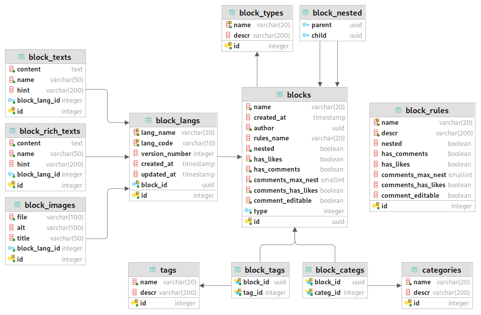
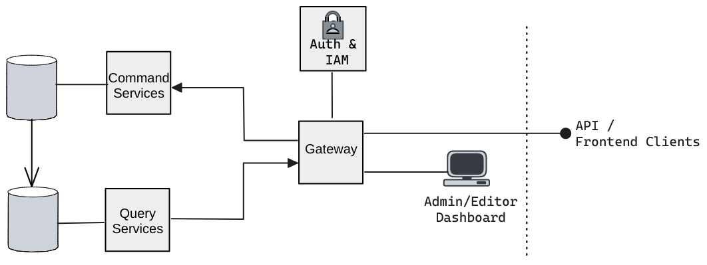
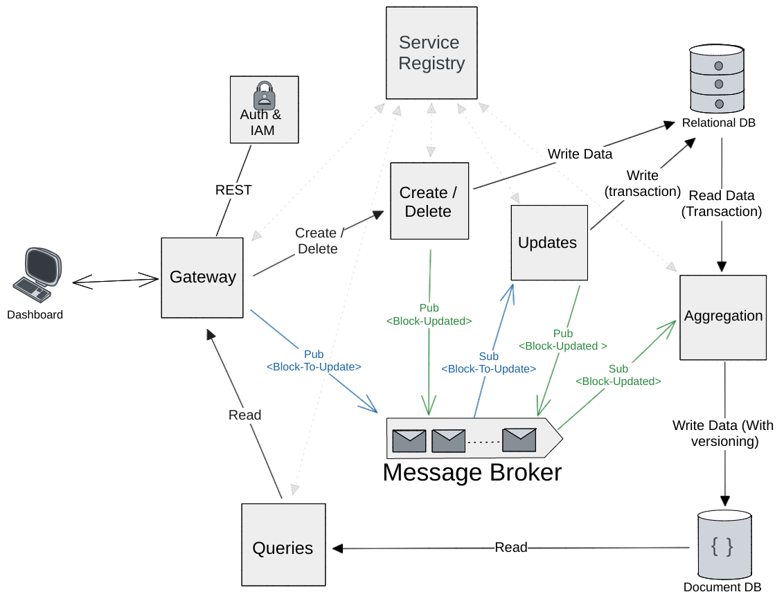

# Shortyio

> ~~**This project is still under construction :building_construction:**~~

> **:no_entry: This project is on hold :no_entry:**

This repository contains the codebase for my end-of-studies project.

Shortyio is a proof-of-concept for a Headless CMS that can be used to power any `JAM Stack` application.


To build a CMS that can be used universally we defined every web component as a `Block`.

A `Block` can be anything and most importantly it can contain other `blocks`, but fundamentally it's composed of files, text, or rich text.



## Backend Structure

The backend is implemented in `Go` and employs various design patterns including CQRS (Command Query Responsibility Segregation) and Event-Driven architecture.

The idea is to build each component into its own microservice and have them communicate, whether through a message queue (in our case [NATS](https://nats.io/)) or `gRPC`.

> This is an experimental project; Some of the decisions made were not the best.



Because we are following a CQRS architecture, we decided to opt for two types of databases:
- `PostgreSQL` for write operations
- `MongoDB` for read operations

### Microservices:



This is the project structure. Each of these is a `Go` project (module) that will run as a microservice. We use Docker and Docker-compose for local development.

```
├── Aggregator
├── Commands
│   ├── FlipFlop
│   └── Metamorphosis
├── Queries
├── Shared
├── Web
└── go.work
```

- Aggregator: Responsible for aggregating data from the write database to the read database.
- Commands:
  - FlipFlop: Handles creation and deletion operations.
  - Metamorphosis: Manages update operations.
- Queries: Responsible for handling read operations.
- Shared: Contains a shared library used by multiple microservices.
- Web: The gateway between our backend and either the dashboard or a Rest API.

If you are are wondering about the lacking of a user management and auth service it's because we are using [KeyCloak](https://www.keycloak.org/) a fully integrated user-management solution.

All services are registered and monitored through [Consul](https://www.consul.io/): Service Registry/Discovery and a KV store for configs.

Services that are communicating directly using `gRPC` need to go through `Consul` and perform a look-aside load balancing technique.


## Frontend

The frontend is built using React+TS and incorporates a custom design system. This design system is based on [Radix UI](https://www.radix-ui.com/), [Tailwind CSS](https://tailwindcss.com/), and [TanStack Table](https://tanstack.com/table).

It's worth noting that this design system was developed prior to the release of [shadcn/ui](https://ui.shadcn.com/), and it may have served as an inspiration for that project (I'm joking ofc).

Specifications:
```
React 18 + Vite
TypeScript
Tailwind
Radix UI + TanStack Table
TanStack Query
Axios
```
## LICENSE
Shortyio: A Headless CMS

Copyright (C) 2023 Jihed MASTOURI

This program is free software: you can redistribute it and/or modify
it under the terms of the GNU Affero General Public License as published by
the Free Software Foundation, either version 3 of the License, or any later version.

This program is distributed in the hope that it will be useful,
but WITHOUT ANY WARRANTY; without even the implied warranty of
MERCHANTABILITY or FITNESS FOR A PARTICULAR PURPOSE.  See the
GNU Affero General Public License for more details.

You should have received a copy of the GNU Affero General Public License
along with this program.  If not, see <https://www.gnu.org/licenses/>.
